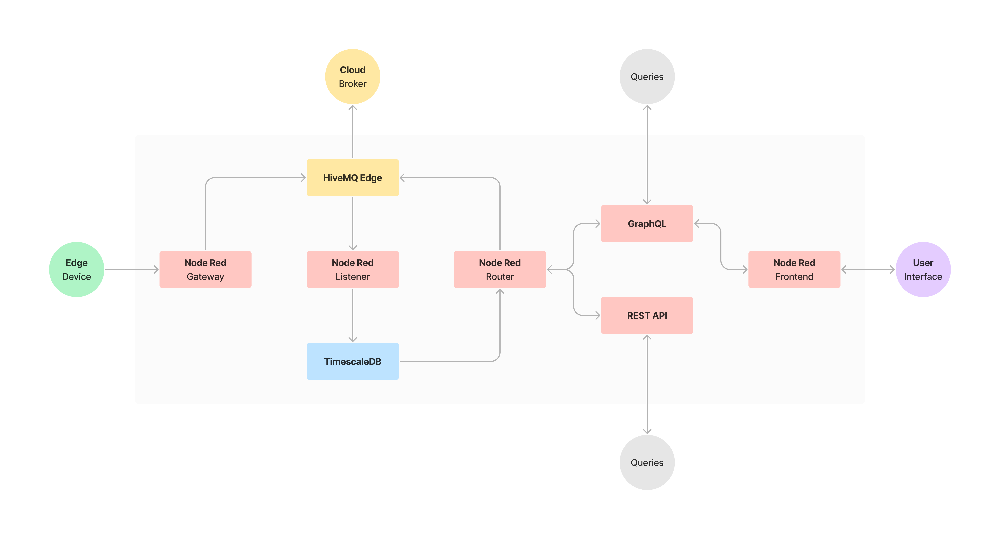

# Node Historian

# 

## Overview
This stack serves as a simple solution for data monitoring, history, and analytics. It integrates the following technologies to create a demo that shows the value of **Connecting, Collecting, and Storing** your IoT data. This is intended as a starting point for discussion and education, not as a definitive or scalable solution.

Key components of the application include:

* **[Node-RED](https://nodered.org/)**: Utilized for its visual programming capabilities, Node-RED is central in orchestrating data flows from various sources. It integrates these flows seamlessly with MQTT and TimescaleDB, making it an essential component for managing data dynamics.

* **[HiveMQ Edge](https://www.hivemq.com/products/hivemq-edge/)**: Operating as the MQTT broker, HiveMQ Edge ensures efficient communication between edge data sources and Node-RED.

* **[TimescaleDB](https://www.timescale.com/)**: An open-source time-series database built on PostgreSQL, TimescaleDB excels in storing and managing the data collected. Its capabilities in handling rapid data ingestion and executing complex queries make it an ideal choice for dealing with time-series data.

The architecture is designed to facilitate easy collection, logging, and querying of metrics data sent over MQTT.

## Prerequisites

Before setting up and running the application, ensure you have the following software and tools installed:

* **Docker**: This application is containerized, so Docker is essential for creating and managing the application's containers. Download Docker.

* **Docker Compose**: Used for defining and running multi-container Docker applications. Docker Compose is typically included in the Docker desktop installation. More about Docker Compose.

## Configuration

### Setting Node-Red Password Using bcrypt

Node-Red requires the use of bcrypt for hashing passwords. To generate a bcrypt hash:

- Visit an online bcrypt generator, like [bcrypt.online](https://bcrypt.online/).
- Enter your desired password and select a Cost Factor. Generate the hash by clicking Generate Hash.
- Copy the generated hash into the .env file for the NODE_RED_PASSWORD. Use single quotes around the hash (e.g. 'generatedhash'). This is important because Docker Compose interprets $ as a special character for variable substitution.

### Environment Variables

The application requires setting environment variables for proper operation. These can be defined by creating an .env file at the root of your project directory.

### Example .env File:

``` plaintext
# Time Zone for the Application
TIMEZONE=America/Chicago

# Node-Red Credentials
NODE_RED_USERNAME=admin
NODE_RED_PASSWORD='bcrypt password goes here'

# TimescaleDB Configuration
TIMESCALE_DATABASE_NAME=NodeHistorian
TIMESCALE_USERNAME=admin
TIMESCALE_PASSWORD=password
```

## Installation

### Docker Setup

To set up Docker and Docker Compose on your system, follow these steps:

1. **Install Docker**: 

   - Visit the [Docker website](https://www.docker.com/get-started) and download the appropriate installer for your operating system.
   - Follow the installation instructions provided for Docker.

2. **Install Docker Compose**:

   - Docker Desktop for Windows and Mac includes Docker Compose. For Linux users, you'll need to install it separately. Instructions can be found on the [official Docker documentation](https://docs.docker.com/compose/install/).

3. **Verify Installation**:

   - Once installed, you can verify the installation and check the versions by running the following commands in your terminal or command prompt:
        ```bash
        docker --version
        docker-compose --version
        ```

### Running the Application

To get the application up and running, follow these steps:

1. **Clone the Repository**:

   - If you have Git installed, clone the repository using:

     ```bash
     git clone https://github.com/DMDuFresne/Node-Historian
     ```

   - If you don’t have Git, you can directly download the source code from the repository as a ZIP file and extract it.

2. **Navigate to the Project Directory**:

   - Open a terminal or command prompt and navigate to the directory where you cloned or extracted the project.

3. **Environment Variables Setup**:

   - Before starting the application, ensure you have set up all the required environment variables. These can be set in a `.env` file in the root of the project directory.

4. **Start the Application with Docker Compose**:

   - Run the following command to start all services defined in the `docker-compose.yml` file.
     ```bash
     docker-compose up -d
     ```
   - The `-d` flag runs the containers in the background. You can omit this if you want to see the logs in the terminal.
   - Use the `--build` flag if you need to build or rebuild services. For instance, after making changes to the Node-Red Dockerfile, flows.json, package.json, or settings.js.
     ```bash
     docker-compose up --build
     ```

5. **Verify the Application is Running**:

   - Check the status of the containers using:

     ```bash
     docker-compose ps
     ```

   - All services should be listed as "Up".

6. **Accessing the Application**:

   - Open your web browser and navigate to the Node-RED interface, usually available at `http://localhost:1880`.
   - You can interact with other components like the TimescaleDB or MQTT broker based on their respective ports and configurations.

## Usage

### Database Schema

The TimescaleDB database is set up with a `metrics` table, which includes the following fields:

- `database_timestamp`: The timestamp when the data is recorded in the database. Automatically set to the current time.
- `server_timestamp`: The timestamp from the data source, indicating when the data was received by the server.
- `datatype`: A text field describing the type of data (e.g. `number`, `string`, or `object`).
- `topic`: The MQTT topic from which the data is sourced, as a text field.
- `data`: The actual data payload. Stored as a JSONB object to allow for flexible and structured data storage.

### REST API

The REST API provides endpoints for interacting with the database:

- **GET** `localhost:1880/metrics`:

  - Retrieves metrics data from the Historian (TimescaleDB).
  - Accepts query parameters in the request body as raw JSON to filter results by topic, datatype, time range, and record limit.
    - `topic`: Filter by MQTT topic, allowing the use of `%` as a wildcard.
    - `datatype`: Filter data based on its type (e.g. `number`, `string`, or `object`).
    - `start`: Start timestamp for the data range (inclusive).
    - `end`: End timestamp for the data range (inclusive).
    - `max`: Maximum number of records to retrieve.
  - Example Body JSON for HTTP GET request:
    ```json
    {
        "topic": "%sensor1/temperature%",
        "datatype": "number",
        "start": "2023-01-01",
        "end": "2023-12-31",
        "max": 100
    }
    ```

- **POST** `localhost:1880/metrics`:

  - Publishes a new metric to the MQTT broker. Node-RED is subscribed to these topics and logs the metric to the historian.
  - Requires a JSON payload in the request body matching the database schema.
    - `topic`: MQTT topic to publish to.
    - `recursive`:  (Optional) Boolean flag indicating if the payload should be published recursively.
    - `data`: The data to be published.
  - Example Body JSON: 
    ```json
    {
      "topic": "Enterprise/Site/Area/Line/Cell/sensor1/temperature",
      "data": 22.5
    }
    ```
    ```json
    {
      "topic": "Enterprise/Site/Area/Line/Cell/sensor1/temperature",
      "recursive": true,
      "data": {"value": 22.5, "units": "F"}
    }
    ```

### GraphQL API

The GraphQL API provides a flexible interface for querying and mutating data in the TimescaleDB. It mirrors the functionality of the REST API, offering enhanced querying capabilities.

**Endpoint**:

* URL: http://localhost:1880/graphql
* Use this endpoint for all GraphQL queries and mutations.

**Schema Overview**:

* **Scalars**:
    - `JSON`: Represents JSON objects.
    - `DateTime`: Represents date and time in ISO 8601 format.

 * **Types**:

    - Metric: Represents a metric data point with fields for timestamp, datatype, topic, and data.
      - `timestamp` (DateTime): The server timestamp when the data was received and recorded. This is different from the database_timestamp, which is when the data is recorded in the database. The timestamp in the Metric type corresponds to the server_timestamp in the database.
      - `datatype` (String): A text field describing the type of the data (e.g. `number`, `string`, or `object`). This field helps in understanding the nature of the data stored in the data field.
      - `topic` (String): The MQTT topic from which the data is sourced. This field is crucial for identifying the source and context of the data, especially in systems with multiple sensors or data sources.
      - `data` (JSON): The actual data payload. Stored as a JSON object, it allows for flexible and structured data storage. The content of this field can vary greatly depending on the nature of the data being monitored or collected.

- **Querying Metrics**:

  - Retrieves metrics data from the Historian (TimescaleDB).
  - Arguments:
    - `topic`: Filter by MQTT topic, allowing the use of `%` as a wildcard.
    - `datatype`: Filter data based on its type (e.g. `number`, `string`, or `object`).
    - `start`: Start timestamp for the data range (inclusive).
    - `end`: End timestamp for the data range (inclusive).
    - `max`: Maximum number of records to retrieve.
  - Example queries:
    ```graphql
    query {
      metrics(
        topic: "sensor1/temperature",
        start: "2023-01-01", 
        end: "2023-01-02"
      ) {
      timestamp
      data
      }
    }
    ```
    ```graphql
    query {
      metrics(
        topic: "%temperature%"
        datatype: "number",
        start: "2023-01-01", 
        end: "2023-01-02"
        max: 99
      ) {
        timestamp
        topic
        datatype
        data
      }
    }
    ```
  
- **Publishing a Metric**:

  - Publishes a new metric to the MQTT broker. Node-RED is subscribed to these topics and logs the metric to the historian.
  - Arguments:
    - `topic`: MQTT topic to publish to.
    - `recursive`:  (Optional) Boolean flag indicating if the payload should be published recursively.
    - `data`: The data to be published.
  - Example mutations:
    ```graphql
    mutation {
      addMetric(
        topic: "sensor1/temperature"
        data: { value: 22.5, type: "Data" }
        recursive: true
      ) {
        datatype
        topic
        data
      }
    }
    ```
    ```graphql
    mutation {
      addMetric(
        topic: "sensor1/temperature"
        data: 22.5
      ) {
        datatype
        topic
        data
      }
    }
    ```
  